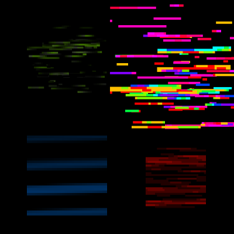

# Kubus

Larger resolution screenshots: [1](screenshots/aphex.png)
[2](screenshots/autechre.png)
[3](screenshots/eno.png)
[4](screenshots/rainbow.png)
[5](screenshots/white.png)

Kubus is a minimalist audio visualizer, written in C/C++ using OpenGL and RtAudio. 
The aesthetic of Kubus draws inspiration from artists like Ryoji Ikeda and Viznut.

## Compilation

Kubus has been tested on OSX and Linux. You will need GLUT in order to compile.
On Linux, JACK will need to be installed.

To compile, run:

make

## Usage

After compilation, Kubus can be invoked from the commandline by running "./kubus".

There are a number of modes that can be toggled with keystroke commands:

**FFT mode (f):**

Maps strength of FFT bins to color saturation of the squares.

**Jitter mode (j):**

Detects sibilant frequencies and adds randomness to the squares frequencies when
it passes a threshold. 

**Pulsate mode (p):**

Maps overall amplitude to the the size of the square.

**Rainbow mode (r):**

Maps sample amplitude to the color hue.

**"8-bit" mode (b):**

Quantizes the colors to achieve a more low-fi feel. 

These modes, as well as several other parameters can be configured with a INI-style
configuration file. By default, Kubus will try to look for a file called "config.ini", 
but custom INI files can be loaded by passing it in as a parameter on the commandline
(ex: "./kubus custom.ini").

